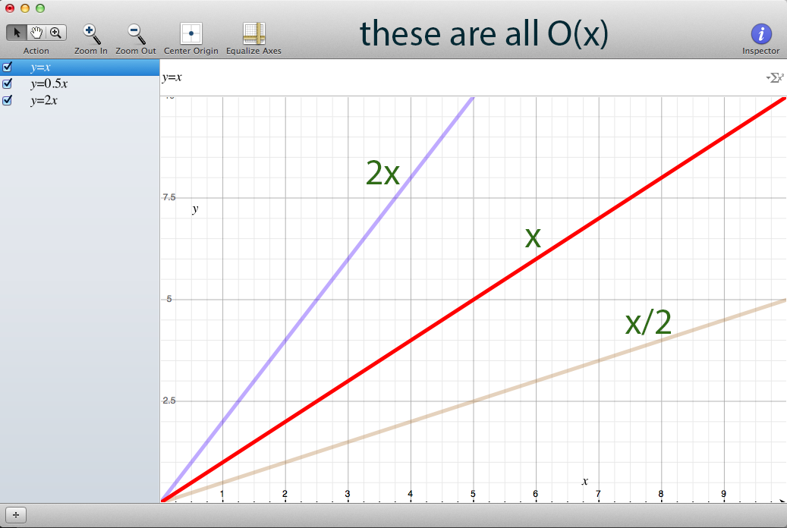
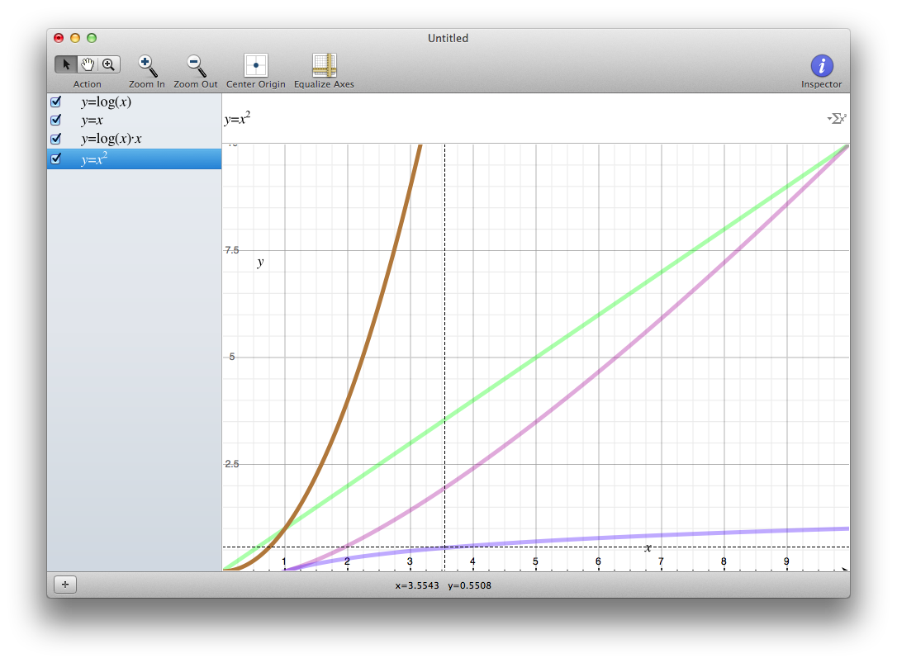
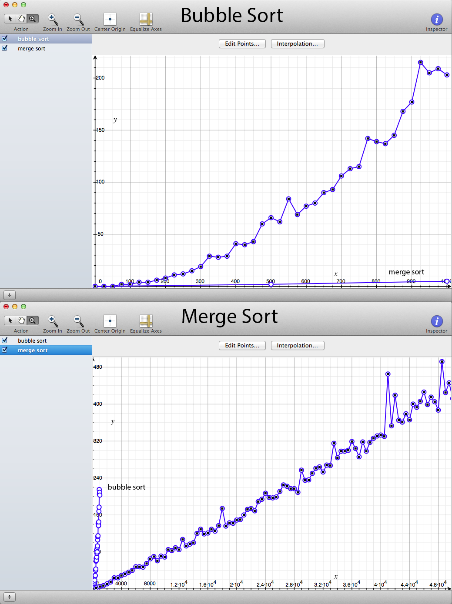

# Big O Notation

Purpose: Understand the categories of algorithms based on
how much time they take to do their job as the number of inputs grows.

Outcomes: Students can recognize scaling patterns of algorithms,
identify better algorithms based on their time complexity.

## What is Big O Notation

Big O Notation is a way to describe the time complexity of
an algorithm. The time complexity can be thought of as
"if it takes 10 seconds on 100 items, how many seconds
will it take for 200 items?"

Because we are interested in the answer relative to a previous input,
we wind up identifying not the *actual time* it takes, but but rather
*how the time grows* as we change the number of items.

In reality, we count time by counting "number of operations performed",
and assuming that in general, an operation will take a constant amount of time,
and so it is the number of operations, relative to the number of inputs,
which drives the time complexity.


## What does it look like, what does it mean?

`O(n)` would be read as "Big-oh of n"

This means that if we were to make a graph showing how the number of inputs, `n`,
relates to the amount of time required to perform the task, that we would expect
the graph to be linear, if 10 inputs take 30 seconds, then 20 inputs takes 1 minute.

`O(n^2)` would be read as "Big-oh of n squared"

If 10 inputs takes 30 seconds, then 20 inputs takes 2 minutes. How did we get that?
Because `n^2` where we are doubling n becomes `(2n)^2` becomes `(2^2)(n^2)` becomes`4(n^2)`
And we know that `n^2` is 30 seconds, so `4(n^2)` must be `4 * 30 seconds`
which is `2 minutes`.

## The variable name doesn't matter

`O(x)` and `O(x)` are the same thing, we just changed the name of the variable.

Typically, people use `x` when talking about a mathematical equation,
and `n` when talking about a discrete number of operations across a collection.


## Thought Experiment: Approximate how long an algorithm takes

Say a user searches for something in our application.
We want to display the results, but also to include results that the
user potentially intended. Maybe we use the Hamming distance between
the user's input and the set of potential topics.

If we have **100 topics**, we iterate over each to calculate its Hamming distance,
and then we take the 5 closest topics to include in the results.
Maybe this takes us **1 second** to perform.

* How long would we expect it to take if we had 200 topics?
* How long if we had 400 topics?
* How does this algorithm grow?

If it instead took us **2 seconds** to calculate **100 topics**

* How long would we expect it to take if we had 200 topics?
* 400?
* How does this algorithm grow?

## What matters is how it grows, not the actual values

Given that the above algorithm grows linearly, we would say that it is
`O(n)`, even though in one case, it took longer to do those n operations.
Maybe one algorithm always takes five times as long as another, but Big O is not
concerned with this, it's concerned with **how the time changes** as we
scale `n` up.

Say we have a function that takes the number of inputs, and returns the number
of operations that will be performed (and assume that all operations take the
same amount of time). Lets say this is linear, so each input we add will add
1 more operation.

```
f(n)  = n
f(2n) = 2n

And how does it grow when doubling the input?
f(2n) / f(n)
= 2n/n
= 2
```

So doubling the number of inputs doubles the time.

Now, lets say we have another linear algorithm, but it does 5 times as many operations.

```
f(n)  = 5n
f(2n) = 5(2n)
      = 10n
And how does it grow when doubling the input?
f(2n) / f(n)
= 10n / 5n
= 2
```

So whether it takes 5 times longer or not, **this doesn't affect how it grows**.
An input twice as big will take twice as long, no matter what the constant is.





## Exercise: Binary search vs sequential search

Say we have a sorted array with 8 elements in it.

### Sequential Search

We want to identify whether an element is in the array,
so we start at the beginning and check each element
until we find or don't find it.

What is the time complexity of this?

We must potentially iterate over the entire array to identify whether
it contains the element. And on average, we'd expect to find it halfway down.

So, if we never find the element, we iterate 8 times... n times.
And if we always find the element, we average 4 times... 1/2 n times.

So we can expect that it's somewhere between 0.5 and 1 n.
But that value is a constant, it doesn't matter, so we wind up with `O(n)`


### Binary Search

Now, since it's sorted, we can use a binary search.

What is the time complexity of this?

A binary search cuts out half the possibilities on each iteration.
So iteration 1 will cut the possibilities to 4,
the second iteration will cut the possibilities to 2,
the third iteration will cut the possibilities to 1.

It takes 3 iterations to find the element.

Because we are dividing each time instead of multiplying,
we are looking at logarithms.

```ruby
def log_base_2(n)
  Math.log(n) / Math.log(2)
end

log_base_2 1   # => 0.0
log_base_2 2   # => 1.0
log_base_2 4   # => 2.0
log_base_2 8   # => 3.0
log_base_2 16  # => 4.0
log_base_2 32  # => 5.0
log_base_2 64  # => 6.0
```

In the same way that the constant doesn't matter, neither does
the base of a logarithm. The time complexity is the same for
logarithmic functions, they grow with a similar pattern.

So binary search is `O(log(n))`

## Common Time Complexities

Here are some common time complexities,
notice that as we graph them, we can see their characteristics.



Notice that the brown line, `O(x²)` is not always worst.
In fact, it beats the green line,`O(x)` for a while.
Since we're interested in how it grows, that is a discussion
of scale. As `n` gets larger and larger, what happens to the time.
But it doesn't mean that an algorithm with a lower time complexity
is always better.

## Example Bubble Sort vs Merge Sort

In the time_sort_algorithms directory, there is a program,
`bubble_vs_merge_sort.rb` where I wrote both a bubble sort
and a merge sort. It randomly generates arrays up to a given size
and then sorts them using the two algorithms.

First, lets try with a few values so we can see:
```
$ ruby bubble_vs_merge_sort.rb 100 1000 1000 10000
Bubble Sort:
  0 - 0 ms
  100 - 3 ms
  200 - 10 ms
  300 - 18 ms
  400 - 38 ms
  500 - 56 ms
  600 - 76 ms
  700 - 106 ms
  800 - 145 ms
  900 - 193 ms
  1000 - 243 ms
Merge Sort:
  0 - 0 ms
  1000 - 9 ms
  2000 - 13 ms
  3000 - 19 ms
  4000 - 31 ms
  5000 - 37 ms
  6000 - 37 ms
  7000 - 45 ms
  8000 - 51 ms
  9000 - 61 ms
  10000 - 70 ms
```

Notice in the Bubble sort, 200 takes 10ms, and twice that value,
400, takes almost 40ms. This matches up with our predictions from
earlier that `O(n²)` algorithm should take 4 times longer.

Now lets run it for longer:

```
$ ruby bubble_vs_merge_sort.rb 25 1000 500 30000
```

If we take these points (they will vary slightly for each run)
and graph them, we get:



**Question: What are the time complexities?**

Lets graph these and fit the lines to them!


## When one variable dominates the others

Lets say you have an algorithm that increases in time complexity
such that it is `O(x² + 2x + 5)` So maybe


We can see that the equation adding the `2x` increases faster,
but the curve looks pretty similar.

When x is 100, then x² is 10,000, and 2x is only `200`, because the
order of growth is so much smaller than the x², we say that this segment
of the equation dominates it. And since we're interested in general
trends, not precise values, we choose to disregard it.

So `O(x² + 2x + 5) = O(x²)`

## Question: What is the time complexity?

**What's the time complexity to get the first item out of an array?**

What if the array has one hundred items? What if it has one million?

No matter how big the array is, we always know where the first element is,
and we can get it in the same amount of operations and thus time,
regardless of the size of the array.

We call this idea "constant time", and it is represented with `O(1)`

### Question: Which is better?

* `O(n)` or `O(x)`?
* `O(n)` or `O(n²)`?
* `O(1)` or `O(log(n))`?
* `O(n)` or `O(log(x))`?

## Question: What is the time complexity?

```ruby
def in_array_more_than_once?(array, target)
  first_index = nil
  array.each_with_index do |current, index|
    next unless current == target
    first_index = index
    break
  end

  found_another = false
  array.each_with_index do |current, index|
    next unless current == target
    next if first_index == index
    found_another = true
  end

  found_another
end
```

Because we potentially iterate through the entire array twice,
we have `O(n+n) = O(2n) = O(n)`

### Question: What is the time complexity?

```ruby
def in_array_more_than_once?(array, target)
  targets = array.select { |element| element == target }
  targets.size > 1
end
```

Here, we iterate only once, so `O(n)`

### Question: What is the time complexity?

```ruby
def times_each_appears(array)
  counts = {}
  array.each do |e1|
    counts[e1] = array.select { |e2| e1 == e2 }.size
  end
  counts
end
```

For each item, we select across the array. To select from the array,
we iterate over the entire thing, so that part is `O(n)`, now how
many times do we perform that operation?

Once for every element in the array, so `n` times, making this `O(n²)`


## Question: If you have 10 items, does time complexity matter?

No. In fact, it's probably misleading at this scale, because it
may take some time to grow high enough for the time complexity to
overcome all the smaller nuances. So understand your problem and
the scale of your problem.

## Question: If you potentially have 1 million items, does time complexity matter?

Yes, at this scale, the amount of additional work you do for each additional item
can make a big difference.

Where do they cross over? That completely depends on implementation,
programming language, and even hardware. You'd have to analyze the specific
type of data and the specific implementation to find the answer.

Many serious sorting algorithms will switch from one type to another
depending on the size of the data. E.g. a quick sort until the array
to be merged is 9 items in size, then switch over to an insertion sort
([example](http://megocode3.wordpress.com/2008/01/28/8/)).

## Question: How seriously should I take this

It's good to be aware of so that you know if you're implementing an
algorithm that won't scale. If you know it needs to scale, you can go
look for or think of a better algorithm. But if you know you're using this
once and just need to get it done, then the inferior algorithm can be better.

## Question: What is the time complexity of:

* A single loop over all the items?
* A single loop over half the items?
* Select in Ruby?
* Find in Ruby?
* A loop over all the items, each iteration of which loops over all the items?
* 2 loops over all the items?
* A loop over a loop over a loop of items?
* Generating every ordering of an array of elements?
